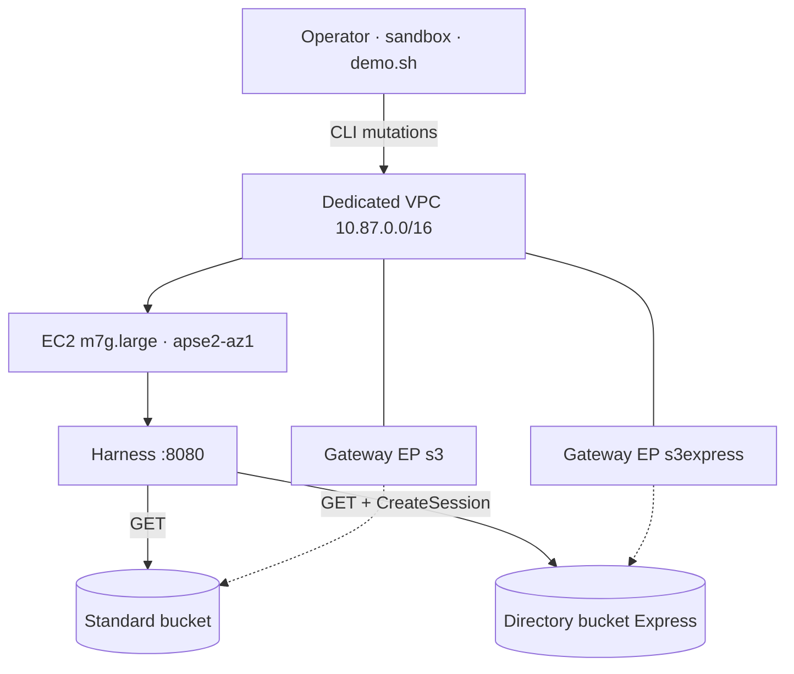
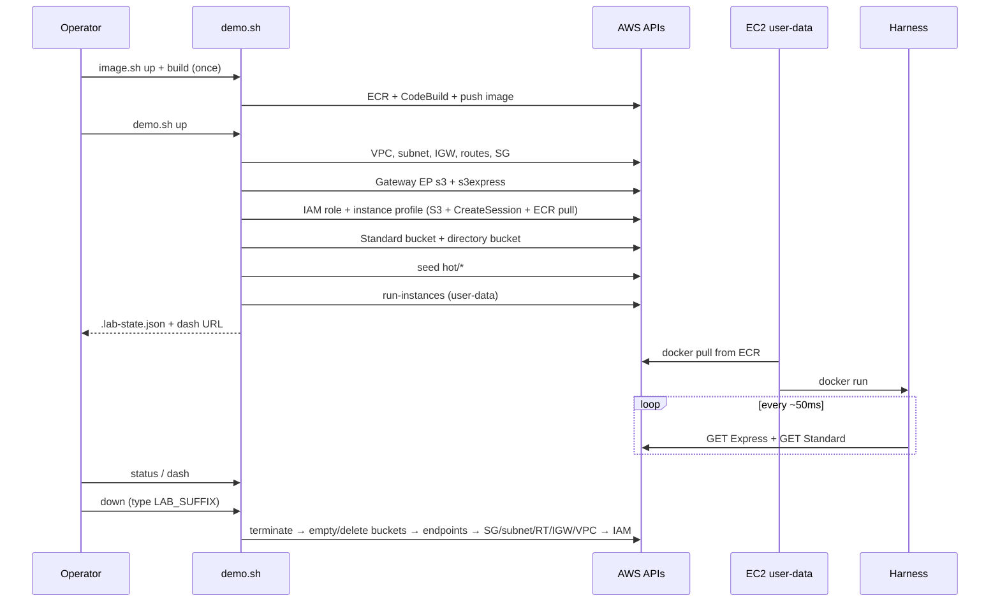

# Architecture — S3 Express hot lookup walkthrough

Detailed design for the lab that co-locates an Amazon S3 Express One Zone
directory bucket with EC2 in `apse2-az1`, continuously GETs the same small keys
from Express and from S3 Standard, and surfaces the latency bakeoff on a
built-in harness dashboard.

This document is the system view. Operator steps live in
`src/content/docs/`. Safety rules live in `.kiro/steering/lab-safety.md`.
AWS behavioural claims must stay aligned with
`.kiro/steering/aws-source-lock.md`.

---

## 1. Purpose

| Question | Answer |
| --- | --- |
| What are we proving? | Same-AZ **shared hot lookup** on Express One Zone is faster for many small random GETs than the same keys on Standard — when compute sits in the Express AZ. |
| What are we *not* proving? | Multi-AZ durability, Mountpoint, analytics pipelines, or a production capacity model. |
| How do you see it? | One Docker harness on EC2 serves `http://<public-ip>:8080/` with live p50 / p90 / p99 and a Standard÷Express ratio. |

Story in one line: **dedicated VPC → two buckets → same-AZ EC2 → continuous GET bakeoff → tear down.**

---

## 2. Context

```text
┌─────────────────────────────────────────────────────────────────────────┐
│ Operator laptop                                                         │
│   AWS_PROFILE=sandbox · AWS_REGION=ap-southeast-2                       │
│   ./scripts/demo.sh  (up | status | seed | harness | dash | down)       │
│   Starlight docs site (local npm run dev / GitHub Pages)                │
└───────────────────────────────┬─────────────────────────────────────────┘
                                │ AWS CLI (echo-before-run)
                                ▼
┌─────────────────────────────────────────────────────────────────────────┐
│ AWS account · ap-southeast-2                                            │
│                                                                         │
│  Dedicated VPC 10.87.0.0/16          S3 (Regional)                      │
│  ┌──────────────────────────┐        ┌─────────────────────────────┐    │
│  │ Public subnet 10.87.1.0/24│        │ Standard GP bucket          │    │
│  │ AZ name ← map(apse2-az1) │        │ s3x-hotlookup-${SUFFIX}-…   │    │
│  │                          │        └──────────────▲──────────────┘    │
│  │  EC2 m7g.large           │                       │ GET (bakeoff)     │
│  │  ┌────────────────────┐  │        ┌──────────────┴──────────────┐    │
│  │  │ Docker: s3x-harness│──┼────────┤ Directory bucket (Express)  │    │
│  │  │ dash :8080         │  │  GET   │ …--apse2-az1--x-s3          │    │
│  │  └────────────────────┘  │        └─────────────────────────────┘    │
│  │                          │                                           │
│  │  Gateway EP · s3         │  (Standard + harness artifact)            │
│  │  Gateway EP · s3express  │  (directory bucket data/control plane)    │
│  │  IGW (bootstrap + dash)  │                                           │
│  └──────────────────────────┘                                           │
└─────────────────────────────────────────────────────────────────────────┘
```

Mermaid equivalent:



---

## 3. Design principles

1. **Same AZ or don’t bother.** Express is a single-AZ product. The EC2 subnet is placed in the account’s AZ *name* that maps to AZ *ID* `apse2-az1`. Cross-AZ (or laptop) GETs invalidate the latency story.
2. **Dedicated VPC.** The lab never attaches to a shared or pre-existing VPC. Prefix `10.87.0.0/16` keeps it greppable.
3. **Two gateway endpoints.** General-purpose S3 and directory-bucket (Express) traffic use different service names: `com.amazonaws.ap-southeast-2.s3` and `com.amazonaws.ap-southeast-2.s3express`.
4. **CreateSession, not classic object IAM on Express.** Zonal object APIs are authorized through `s3express:CreateSession` on the directory bucket ARN. The SDK/CLI obtain the session token automatically.
5. **One observability surface.** No Prometheus, no CloudWatch dashboard as the primary UX — one process, `/api/stats` + `dash.html`.
6. **CLI teaches.** `demo.sh` echoes every AWS call. Agents author; operators run (`S3X_LAB_ALLOW_AWS=1` when the mutation guard is active).
7. **Billable until `down`.** Every resource is tagged `Project=s3-express-hot-lookup-walkthrough` and named with `s3x-hotlookup-${LAB_SUFFIX}-…`.

---

## 4. Component inventory

### 4.1 Control plane (operator)

| Component | Role |
| --- | --- |
| `scripts/demo.sh` | Orchestrates create / status / seed / dash / teardown. Writes `.lab-state.json`. |
| `scripts/image.sh` | Durable ECR + CodeBuild pipeline (`up` / `build` / `status` / `down`). Writes `.image-state.json`. |
| `.lab/` | Working dir: trust/permissions JSON, user-data, CodeBuild zip. Gitignored. |
| `.lab-state.json` | Region, profile, suffix, VPC/subnet/SG/endpoint IDs, bucket names, instance id, public IP, harness image URI. Gitignored. |
| `.image-state.json` | ECR URI, CodeBuild project, source bucket, last image tag. Gitignored. |
| Starlight site | Human walkthrough; does not talk to AWS itself. |

### 4.2 Network

| Resource | Value / notes |
| --- | --- |
| VPC | `10.87.0.0/16`, DNS support + hostnames on |
| Public subnet | `10.87.1.0/24`, `MapPublicIpOnLaunch`, AZ = mapped `apse2-az1` |
| Internet gateway | Bootstrap (`dnf`, Docker image pull) + dashboard HTTP |
| Route table | `0.0.0.0/0 → IGW`; associated to the public subnet |
| Security group | Ingress TCP `HARNESS_PORT` (default 8080) from `DASH_CIDR` (default `0.0.0.0/0` — lab only); default egress |
| VPC endpoint (Gateway) | `com.amazonaws.${region}.s3` |
| VPC endpoint (Gateway) | `com.amazonaws.${region}.s3express` |

Both endpoints attach to the lab route table so in-VPC S3/Express traffic stays on the AWS network. IGW remains required for package/image pulls and for the operator to reach `:8080`.

### 4.3 Storage

| Bucket | Type | Name pattern | Purpose |
| --- | --- | --- | --- |
| Standard | General purpose | `s3x-hotlookup-${LAB_SUFFIX}-${ACCOUNT_ID}` | Bakeoff baseline |
| Express | Directory / One Zone | `s3x-hotlookup-${LAB_SUFFIX}--apse2-az1--x-s3` | Hot lookup tier under test |

Seeded objects (defaults):

| Parameter | Default |
| --- | --- |
| Prefix | `hot/` |
| Count | `64` |
| Size | `16384` bytes (16 KiB) |
| Key shape | `hot/obj-0000.bin` … `hot/obj-0063.bin` |

Identical keys and bytes land in **both** buckets so the harness compares like-for-like GETs.

Directory bucket create (control plane) uses:

```text
Location={Type=AvailabilityZone,Name=apse2-az1},
Bucket={DataRedundancy=SingleAvailabilityZone,Type=Directory}
```

Base name length is capped so `base--apse2-az1--x-s3` stays ≤ 63 characters (`demo.sh` enforces base ≤ 47).

### 4.4 Identity

| Resource | Purpose |
| --- | --- |
| IAM role `s3x-hotlookup-${SUFFIX}-ec2` | Trusted by `ec2.amazonaws.com` |
| Inline policy `${NAME_PREFIX}-s3` | Standard object/list on the bakeoff bucket; `s3express:CreateSession` on the directory bucket; `ecr:GetAuthorizationToken` + pull on `s3x-hotlookup-harness` |
| Instance profile | Attached to the EC2 instance |

Operator credentials (`sandbox`) create and delete resources. The instance role is what the harness uses at runtime — no long-lived keys on the box.

### 4.5 Compute

| Setting | Value |
| --- | --- |
| AMI | Latest AL2023 arm64 via SSM parameter `/aws/service/ami-amazon-linux-latest/al2023-ami-kernel-default-arm64` |
| Instance type | `m7g.large` (Graviton; override with `INSTANCE_TYPE`) |
| Placement | Lab subnet → Express AZ |
| IMDSv2 | Required |
| User data | Install Docker → ECR login → `docker pull` harness image → `docker run -p 8080:8080` |

### 4.6 Image pipeline (durable)

| Resource | Name | Role |
| --- | --- | --- |
| ECR repository | `s3x-hotlookup-harness` | Stores harness image tags (`:latest` + git SHA / timestamp) |
| CodeBuild project | `s3x-hotlookup-harness` | Privileged **ARM** Docker build (`ARM_CONTAINER`) from S3 source zip |
| Source bucket | `s3x-hotlookup-cb-${ACCOUNT_ID}` | Holds `source/harness-src.zip` |
| IAM role | `s3x-hotlookup-codebuild` | Logs + S3 get + ECR push |

Managed by `./scripts/image.sh`. **Not** deleted by `./scripts/demo.sh down`.

### 4.7 Harness (`harness/`)

| Piece | Behaviour |
| --- | --- |
| Runtime | Python 3.12 slim container, `boto3` |
| Worker loop | Pick random key → GET Express → GET Standard → sleep `LOOP_SLEEP_MS` (default 50) |
| Latency window | Rolling `WINDOW_SECONDS` (default 300); p50 / p90 / p99 / mean; error counts |
| `GET /` | `dash.html` (auto-refresh every 2s) |
| `GET /api/stats` | JSON snapshot including `standard_over_express_p50` |
| `GET /healthz` | Liveness for `demo.sh status` |

Env consumed on the instance: `AWS_REGION`, `EXPRESS_BUCKET`, `STANDARD_BUCKET`, `OBJECT_COUNT`, `OBJECT_PREFIX`, `HARNESS_PORT`.

---

## 5. Request paths

### 5.1 Hot GET (Express)

```text
Harness (EC2, apse2-az1)
  → IMDS credentials (instance role)
  → CreateSession (zonal)   [SDK, automatic]
  → GetObject on directory bucket
  → Zonal endpoint s3express-apse2-az1.ap-southeast-2.amazonaws.com
  → Prefers VPC gateway endpoint com.amazonaws.ap-southeast-2.s3express
```

### 5.2 Hot GET (Standard)

```text
Harness
  → GetObject on general-purpose bucket
  → Regional S3 endpoint
  → Prefers VPC gateway endpoint com.amazonaws.ap-southeast-2.s3
```

### 5.3 Operator dashboard

```text
Browser → http://<EC2 public IP>:8080/
       → SG allow TCP 8080 from DASH_CIDR
       → harness ThreadingHTTPServer
```

### 5.4 Bootstrap image pull

```text
./scripts/image.sh build
  → zip harness/ → s3://s3x-hotlookup-cb-$ACCOUNT/source/harness-src.zip
  → CodeBuild docker build + push
  → $ACCOUNT.dkr.ecr.$REGION.amazonaws.com/s3x-hotlookup-harness:$TAG

demo.sh up → EC2 user-data
  → aws ecr get-login-password | docker login
  → docker pull $HARNESS_IMAGE
  → docker run … $HARNESS_IMAGE
```

---

## 6. Lifecycle (`demo.sh`)



### Bring-up order (`image.sh` then `demo.sh up`)

0. `./scripts/image.sh up` then `./scripts/image.sh build` (durable; skip if image exists).
1. Resolve `LAB_SUFFIX` (or generate timestamp).
2. Map `apse2-az1` → AZ name via `describe-availability-zones --zone-ids`.
3. Resolve harness image URI from ECR (`HARNESS_IMAGE_TAG` / `.image-state.json` / `latest`).
4. VPC → IGW → subnet → route → SG → dual gateway endpoints.
5. IAM role, inline policy (S3 + CreateSession + ECR pull), instance profile.
6. Create Standard bucket; create directory bucket; seed identical objects.
7. Launch EC2 with user-data (ECR pull + run); wait `instance-running`; record public IP.
8. Persist `.lab-state.json`.

### Tear-down order (`down`)

1. Confirm by typing stored `LAB_SUFFIX`.
2. Terminate instance; wait terminated.
3. Empty + delete Standard bucket; empty + delete directory bucket.
4. Delete both VPC endpoints.
5. Delete SG (retry — ENI detach lag), subnet, route table, detach/delete IGW, delete VPC.
6. Remove role from instance profile; delete profile, inline policy, role.
7. Remove `.lab-state.json`.

---

## 7. Naming, tagging, configuration

| Convention | Value |
| --- | --- |
| Profile (documented) | `sandbox` |
| Region | `ap-southeast-2` |
| Express AZ ID | `apse2-az1` |
| Name prefix | `s3x-hotlookup` |
| Tag | `Project=s3-express-hot-lookup-walkthrough` |
| Mutation opt-in | `S3X_LAB_ALLOW_AWS=1` |
| AWS CLI | min `2.15.0` (latest v2 fine) |
| ECR repository | `s3x-hotlookup-harness` |
| CodeBuild project | `s3x-hotlookup-harness` |

Optional env overrides: `LAB_SUFFIX`, `HARNESS_IMAGE`, `HARNESS_IMAGE_TAG`, `INSTANCE_TYPE`, `OBJECT_COUNT`, `OBJECT_SIZE_BYTES`, `OBJECT_PREFIX`, `HARNESS_PORT`, `DASH_CIDR`.

---

## 8. Failure domains and constraints

| Constraint | Implication |
| --- | --- |
| Single Express AZ in Sydney (`apse2-az1`) | No multi-AZ Express story in this Region for the lab. |
| Directory bucket = single AZ durability | Lab data is disposable; not a DR pattern. |
| Wrong AZ / laptop GETs | Latency gap collapses or reverses; `status` alone cannot diagnose that — check AZ mapping. |
| Missing `s3express` gateway EP | In-VPC Express data plane may fail or hairpin oddly; lab always creates both endpoints. |
| Missing `CreateSession` | Express GETs fail; Standard may still succeed → dashboard error counters climb on Express only. |
| Bootstrap window | After `up`, Docker install + ECR pull takes minutes; `status` `harness-healthz` stays non-200 until ready. |
| Missing ECR image | `demo.sh up` fails fast — run `./scripts/image.sh build` first. |
| Open `DASH_CIDR` | Default `0.0.0.0/0` is intentional for a short lab; tighten for shared accounts. |

---

## 9. Repository map (architecture-relevant)

```text
architecture.md          ← this file
scripts/demo.sh          ← ephemeral lab lifecycle
scripts/image.sh         ← durable ECR + CodeBuild
harness/
  Dockerfile
  buildspec.yml          ← CodeBuild buildspec (zipped with sources)
  app.py                 ← bakeoff + HTTP API
  dash.html              ← built-in UI
  requirements.txt
.kiro/steering/
  product.md             ← story / non-goals
  lab-safety.md          ← profile, guard, teardown rules
  aws-source-lock.md     ← citation allowlist + verified/TBD facts
.kiro/specs/…/design.md  ← short design note (points here for depth)
src/content/docs/cli/    ← operator-facing steps mirroring this design
```

---

## 10. Out of scope (v1)

- Terraform / CDK / CloudFormation as the primary path
- Mountpoint for Amazon S3 (`--cache-xz`) as the primary demo
- CloudWatch metrics dashboards or Prometheus/Grafana
- Multi-Region replication or Express in Local Zones
- Hard-coded currency prices (link AWS pricing pages instead)

---

## 11. Evidence status

End-to-end `up → dash → down` in a real account is **not yet verified**. Until the evidence pass lands, treat runtime timings, exact bootstrap duration, and observed p50 ratios as TBD. Architecture above matches the authored `demo.sh` / harness contract and published AWS docs cited in the source lock.
